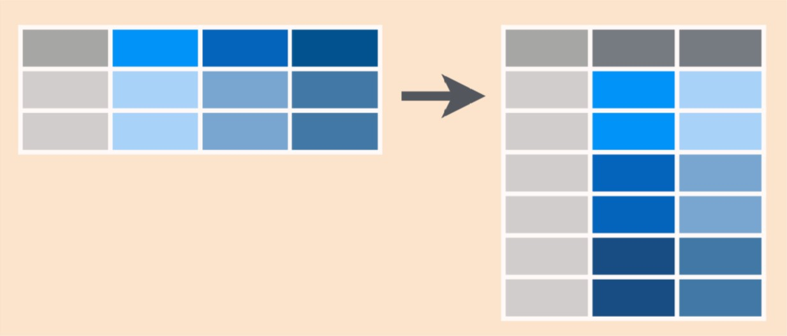

```{r setup, include=FALSE}
knitr::opts_chunk$set(echo = TRUE, fig.height = 4.35, fig.width = 4.75, message = FALSE, warning = FALSE)
```

```{r, include=FALSE}
notes<-params$notes
```

# Let's get set up

## A new dataset

California energy data

- file names: `ca_energy_generation.csv` and `ca_energy_imports.csv`
- Read these two files into your working environment
    - They are in the "data" folder

## Reading in the data

```{r importing}
library(here)
library(readr)
generation <- read.csv(here::here("data/ca_energy_generation.csv"), stringsAsFactors=F)
imports <- read.csv(here::here("data/ca_energy_imports.csv"), stringsAsFactors=F)
```

## Exploring the data

```{r explore data}
str(generation)
```

## Dealing with dates and times

- Notice that the first variable in both datasets is called "datetime"
- What class are these variables?

```{r}
class(generation$datetime)
class(imports$datetime)
```

## Dealing with dates/times with `lubridate`

- The best way to deal with date-time data is to use the `lubridate` package
- You can convert character variables into datetime format using the `as_datetime` function
    - One advantage of `readr::read_csv` is that it will often detect and convert datetime variables when importing

```{r datetime}
library(lubridate)
generation$datetime <- as_datetime(generation$datetime)
class(generation$datetime)
head(generation$datetime)
```

## Dealing with dates/times with `lubridate`
```{r}
imports$datetime <- as_datetime(imports$datetime)
class(imports$datetime)
head(imports$datetime)
```

# Reshaping data

## Wide versus long data

- Principles of "tidy data" (_R for Data Science_ - Wickham & Grolemund)
  1. Each variable must have its own column.
  2. Each observation must have its own row.
  3. Each value must have its own cell.
- Often, we want to make wide data long (or tidy) for analysis



## Wide versus long data

```{r wide data}
head(generation)
```


## Using `reshape2`

- `melt` --> make data long
- `dcast` --> make data wide
- `recast`--> melt then cast data

## Reshaping CA energy data

- Right now, the `generation` dataframe has several observations per row

```{r untidy data}
head(generation)
```

## `melt` the generation data

`melt(df, id.vars = "id")`

- Specify the variable that _doesn't_ melt with `id.vars`

```{r melting}
library(reshape2)
long_gen <- melt(generation, id.vars = "datetime",
                             variable.name = "source",
                             value.name = "usage")
head(long_gen)
```

## `melt` the generation data

```{r reordering}
head(long_gen[order(long_gen$datetime), ])
```


# Merging data

## Merging CA energy data

- Sometimes you have data from two (or more) sources that you want to analyze 
- Need to merge these dataframes together
- To merge, need to chose the columns that have common values between the dataframes
  - Usually a variable with ids or years, or both
  
## Merging the `merge`

`merge(x, y, by = c("id", "year"))`

- Key arguments: 
  - `x`: first dataframe
  - `y`: second dataframe
  - `by`: variables to match (must have common name)

## More `merge` arguments

```{r, eval = F}
merge(x, y, by.x = "id", by.y = "cd", all.x = T, all.y = T)
```

- Advanced arguments:
  - Use `by.x` and `by.y` if the dataframes have different variable names
  - Use `all.x = T` if you want to keep all the observation in the first dataframe (unmatched observations in `y` are dropped!)
  - Use `all.y = T` if you want to keep all observations in the second dataframe (umatched observations in `x` are dropped!)
  - Use both (or, simply `all = T`) to keep all observations!
  - By **default** R will drop unmatched observations from **both** dataframes!

## Merge by `datetime`

- Use `merge` to join the `generation` and `imports` dataframes, using the `datetime` variable to match

## Merge by `datetime`

- Always check your merge!

```{r merge}
merged_energy <- merge(generation, imports, by = "datetime")
dim(merged_energy)
head(merged_energy)
```

## Try reshaping the merged data!

- Our merged dataframe is still wide and untidy
  - Create a long version called `long_merged_energy`
  - Take a peek to make sure the long version looks correct

## Try reshaping the merged data!

```{r melt exercise}
long_merged_energy <- melt(merged_energy, id.vars = "datetime",
                           variable.name = "source",
                           value.name = "usage")
head(long_merged_energy)
```

# Data manipulation

## Two approaches to data manipulation

* <span style="color:orange">`dplyr`</span>,  and <span style="color:blue">`data.table`</span>, are two packages used to process data in tabular form
* it is useful to be familiar with both because:
  * answers to questions on stack overflow will often be presented in a <span style="color:orange">`dplyr`</span> version and a <span style="color:blue">`data.table`</span> version
  * each is built around a different philosophy, so you can choose which suits you most
    * <span style="color:orange">`dplyr`</span>: chain together a few, simple functions
    * <span style="color:blue">`data.table`</span>: compact, syntax-based commands
  * <span style="color:blue">`data.table`</span> is much faster on large data (<span style="color:orange">`dplyr`</span> is explicitly meant for small-to-medium data)

# dplyr!

## dplyr - an idiosyncratic approach to data manipulation

- `dplyr` is an R package for data manipulation developed by Hadley Wickham with help from lots of other R developers
- See https://dplyr.tidyverse.org/ for more guidance
- Principles: consistent syntax, meaningful naming conventions, fewer arguments/more functions 

## Load `tidyverse`

```{r load tidyverse}
library(tidyverse)
```

## `dplyr` verbs

- `select` --> subset variables
- `filter` --> subset observations based on conditions
- `mutate` --> add new variables
- `summarize` --> reduce multiple observations to a single value (e.g., find the mean)

## Trying out `dplyr` verbs - `select`

- select by name: 
  - `select(gapminder, continent, pop)`
- select by position: 
  - `select(df, c(1, 3, 10))`
- select by range:
  - `select(df, country:pop)` or `select(df, 1:3)`
- drop variables with `-`
  - `select(df, -gdpPercap)`

## Trying out `dplyr` verbs - `select`
```{r select}
tmp <- select(merged_energy, biogas, biomass, geothermal, solar)
names(tmp)
tmp <- select(merged_energy, -biogas, -biomass, -geothermal, -solar)
names(tmp)
```

## select helpers

- There are several "select helpers" that make subsetting variables very easy
  - `one_of()`, `contains()`, `starts_with()`, `ends_with()`, `matches()`

```{r}
tmp <- select(merged_energy, contains("hydro"), starts_with("bio"))
names(tmp)
```

## `filter`

```{r filter}
tmp <- filter(merged_energy, imports > 7000)
nrow(tmp)
head(tmp)
```

## multiple conditions in `filter`

```{r multi filter}
tmp <- filter(merged_energy, imports > 7000, natural_gas < 7000)
nrow(tmp)
head(tmp)
```

## `mutate`

- `mutate` creates new variables

```{r mutate}
tmp <- mutate(long_merged_energy, log_usage = log(usage))
head(tmp)
```

## `mutate`

```{r multi mutate}
tmp <- mutate(long_merged_energy, log_usage = log(usage), usage2 = usage^2, usage3 = usage^3)
head(tmp)
```

## `summarize`

`summarize` reduces observations to a single value based on functions
  - `mean`, `sum`, `sd`, `min`, `max`, etc.

```{r summarize}
# total energy consumption
summarize(long_merged_energy, total = sum(usage, na.rm = T))

# mean energy consumption
summarize(long_merged_energy, mean_cons = mean(usage, na.rm = T))
```

## A new operator: the pipe `%>%`

- The powerful `%>%` operator lets you chain together functions
- It sends the result of one function to another function
- Read `%>%` as "then"

```{r introducing the pipe}
# take df then filter it then select these variables
# you do not need to repeat the name of the dataframe!
long_merged_energy %>% 
  filter(source == "geothermal") %>% 
  select(-datetime) %>% 
  mutate(log_usage = log(usage)) %>% 
  summarize(mean_log_usage = mean(log_usage, na.rm = T))
```

## A new operator: the pipe `%>%`

```{r introducing the pipe step 1}
long_merged_energy %>% 
  filter(source == "geothermal")
```

## A new operator: the pipe `%>%`

```{r introducing the pipe step 2}
long_merged_energy %>% 
  filter(source == "geothermal") %>% 
  select(-datetime)
```

## A new operator: the pipe `%>%`

```{r introducing the pipe step 3}
long_merged_energy %>% 
  filter(source == "geothermal") %>% 
  select(-datetime) %>% 
  mutate(log_usage = log(usage))
```

## A new operator: the pipe `%>%`

```{r introducing the pipe step 4}
long_merged_energy %>% 
  filter(source == "geothermal") %>% 
  select(-datetime) %>% 
  mutate(log_usage = log(usage)) %>% 
  summarize(mean_log_usage = mean(log_usage, na.rm = T))
```

## A new operator: the pipe `%>%`

- While piping, the piped dataframe _is not changed_!
- To refer to the manipulated dataframe, use `.`

```{r dot}
merged_energy %>% 
  select(-datetime) %>% 
  mutate(total_usage = rowSums(., na.rm = T)) %>% 
  summarize(total_usage = sum(total_usage, na.rm = T))
```

## A new operator: the pipe `%>%`

- While piping, the piped dataframe _is not changed_!
- To refer to the manipulated dataframe, use `.`

```{r oops, error = T}
merged_energy %>% 
  select(-datetime) %>% 
  mutate(total_usage = rowSums(merged_energy, na.rm = T)) %>% 
  summarize(total_usage = sum(total_usage, na.rm = T))
```

## Try piping

- Using the (wide) merged CA energy data `merged_energy` do the following with pipes:
  1. Select variables that contain the word "hydro"
  2. Create a new variable called `total_hydro` that is the sum of the retained hydro variables
  3. Find the mean usage for `total_hydro`

## Try piping

```{r exercise}
merged_energy %>% 
  select(contains("hydro")) %>% 
  mutate(total_hydro = rowSums(., na.rm = T)) %>%
  summarize(mean_hydro = mean(total_hydro, na.rm = T))
```

## `group_by` and `summarize`

- `group_by` is a powerful function that allows us to perform operations by groups of observations!
  - Very useful with summarize!

```{r group_by}
long_merged_energy %>% 
  group_by(source) %>% 
  summarize(sum_usage = sum(usage, na.rm = T))
```

## `group_by` versus `for` loops

- Remember the `for` loop we wrote yesterday to find the mean life expectancy by year?
- MUCH better in `dplyr`

## `group_by` versus `for` loops

```{r mean le}
gapminder <- read.csv(here::here("data/gapminder5.csv"))

gapminder %>% 
  group_by(year) %>% 
  summarize(mean_le = mean(lifeExp, na.rm = T),
            sd_lf = sd(lifeExp, na.rm = T))
```

## Find the mean by source

- Use your knowledge of `dplyr` to find the mean usage for small hydro, large hydro, biogas, and biomass
- Start with either the wide or long merged dataset

## Find the mean by source

```{r exercise grouping}
merged_energy %>% 
  select(datetime, contains("hydro"), contains("bio")) %>% 
  melt(id.vars = "datetime",
       variable.name = "source",
       value.name = "usage") %>% 
  group_by(source) %>% 
  summarize(mean_usage = mean(usage, na.rm = T))
```

## Merging in `dplyr` with `*_join` functions

- `dplyr`'s philosophy is to have more functions with fewer options
  - `left_join` - keeps all observations in the first dataframe 
    - `merge(all.x = T)`
  - `right_join` - keeps all observations in the second dataframe 
    - `merge(all.y = T)`
  - `full_join` - keeps all observations in both dataframes
    - `merge(all = T)`
  - `inner_join` - keeps only those observations that are matched in both datasets
    - `merge(all = F)`

## Comparing `merge` and `inner_join`
```{r merge and semi_join}
tmp <- merge(generation, imports, by = "datetime", all = F)
dim(tmp)
tmp <- inner_join(generation, imports, by = "datetime")
dim(tmp)
```

